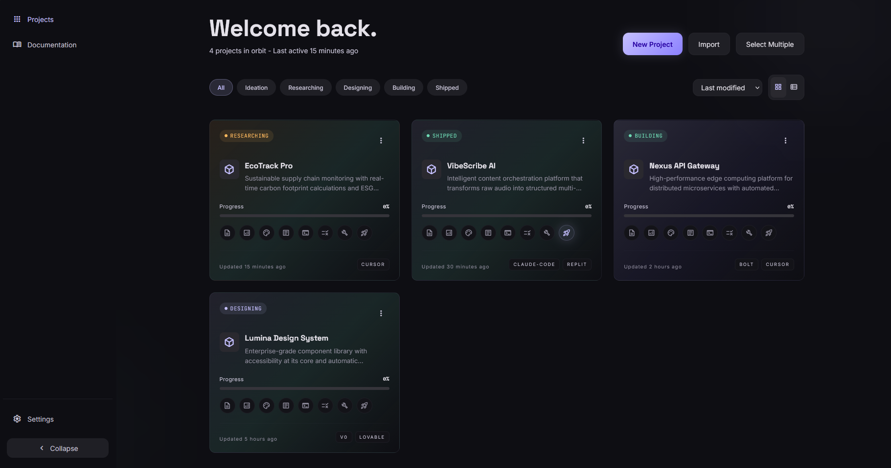
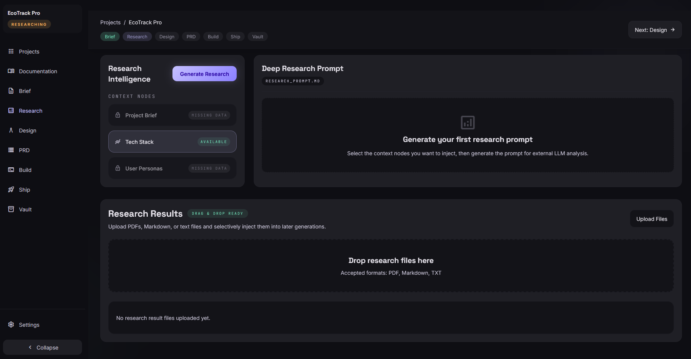
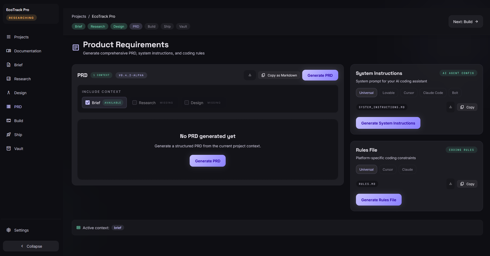
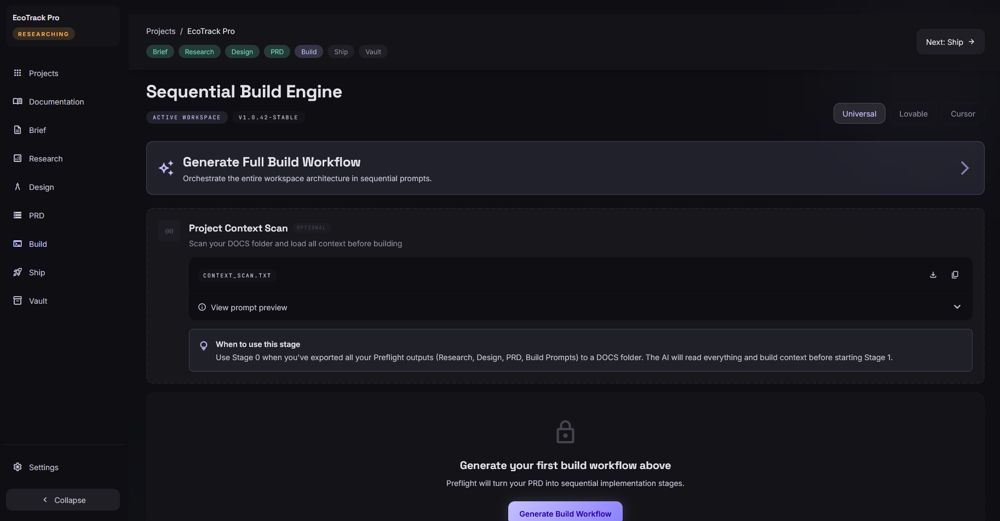

<div align="center">

# ✈️ Preflight

**Your launchpad. Every build.**

*The open-source Project OS for vibe coders — from raw idea to production-ready build package.*

[](LICENSE)
[](https://www.typescriptlang.org/)
[](https://reactjs.org/)
[](https://vitejs.dev/)

[Documentation](docs/README.md) · [Report Bug](https://github.com/Meykiio/preflight/issues) · [Request Feature](https://github.com/Meykiio/preflight/issues)



</div>

---

## What is Preflight?

**Preflight is the tool you use *before* you start coding.**

If you've ever tried building an app with AI tools like Lovable, Bolt, Cursor, or Claude Code, you know it can get messy fast. You lose track of the plan, the AI starts hallucinating, and you end up with a project that's hard to finish.

Preflight fixes this. It's a simple, structured "Project OS" that helps you turn your rough idea into a solid plan that AI can actually follow. 

### How it works:
1.  **Write down your idea** in a simple, structured brief.
2.  **Generate prompts** for deep research and UI design.
3.  **Create a clear PRD** (Product Requirements Document) so the AI knows exactly what to build.
4.  **Follow the build stages** one by one to get a clean, working app.

---

## 📸 A Quick Look

### 1. Project Hub
Keep all your app ideas in one place. No more scattered notes or lost context.


### 2. The Brief
Preflight guides you through defining the problem, your users, and the core features before you write a single line of code.


### 3. Deep Research & Design
Get high-quality research from tools like Perplexity and design prompts for v0 or Stitch. This gives you all the ingredients you need for a great build.
<div align="center">
  
  
</div>

### 4. PRD & System Setup
Generate a full PRD and the perfect `.cursorrules` or `CLAUDE.md` files. This tells the AI agent exactly how to behave like a pro.


### 5. Step-by-Step Build
This is where the magic happens. Preflight breaks your build into stages: Foundation → Database → Features → Audit → Deploy. Paste these prompts one by one into your AI tool for a perfect result.


---

## ⚡ Getting Started

### 1. Install & Run
You just need **Node.js 20+** and **pnpm** (or npm).

```bash
# Clone the repo
git clone https://github.com/Meykiio/preflight.git
cd preflight

# Install dependencies
pnpm install

# Start the dev server
pnpm dev
```

### 2. Connect your AI
Head over to **Settings → AI Providers** and paste your API keys (Anthropic, OpenAI, or Google). 

**Note on Privacy:** Your keys are stored locally in your browser. They never touch our servers.

---

## 🛠 Tech Stack
- **Frontend:** React + TypeScript
- **Styling:** Tailwind CSS (Dark Mode for life)
- **Database:** Dexie.js (Local-first, lives in your browser)
- **State:** Zustand

---

## 🔧 Recent Fixes

### Fixed Gemini API "Network Error"
If you were seeing a 404 or Network Error when connecting Google Gemini, we've fixed it!
- Updated model IDs to match the latest API.
- Better error messages if you're in a region where Gemini isn't available yet.
- Just go to Settings and make sure `gemini-1.5-pro` is selected.

---

## 🤝 Contributing
Preflight is open-source and I'd love your help! If you find a bug or have an idea, feel free to open an issue or a PR.

---

<div align="center">

Made with ⚡ by the Preflight team.
If this helps you build better apps, give it a ⭐!

[Report a Bug](https://github.com/Meykiio/preflight/issues) · [Request a Feature](https://github.com/Meykiio/preflight/issues)

</div>
